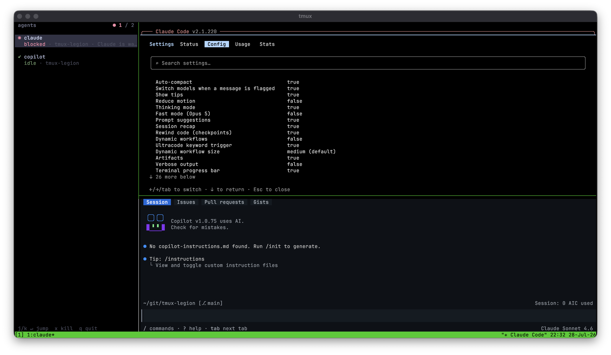

# tmux-legion

[](https://github.com/hawkish/tmux-legion/releases/latest)
[](LICENSE)

A tmux sidebar that tracks every AI agent in your session: **blocked**, **working**,
**done**. Hooks drive the status where the agent supports them; process-tree
discovery finds the rest—including node-wrapped CLIs—with zero configuration.

Inspired by [tmux-agent-sidebar](https://github.com/hiroppy/tmux-agent-sidebar) (sidebar
mechanics, Claude Code hooks) and [herdr](https://github.com/ogulcancelik/herdr)
(explicit status reporting, agent skill, panel styling). Single Rust binary, no daemon.



Each agent gets a three-line row: a status glyph and name, then the model it runs, then
`status · directory · message`. The directory is the last component of the pane's working
directory, so agents spread across repos or worktrees stay apart at a glance. Styling
follows herdr's agents panel (Catppuccin Mocha):

| Glyph | Status | Meaning |
|---|---|---|
| `⠋` spinner (yellow) | working | actively running |
| `◉` (red) | blocked | waiting on you (permission or input) |
| `●` (teal) | done | turn finished, still alive |
| `✓` (green) | idle | waiting for a prompt |
| `○` (gray) | unknown | discovered but unreported |

The header shows the agent count and turns into a red `● N /` badge when any agent is
blocked.

The model line reads `opus-5 · cc 2.1.220` for Claude Code—model first, then the CLI's own
version—and just the model for everyone else. tmux-legion finds it three ways, in this
order: Claude Code sessions get it from the transcript the hooks point at (so a `/model`
switch shows up after the next turn), spawned agents get it from the `--model` flag they
were launched with, and any other tracked pane gets it from the agent's own command line.
An agent that takes its model from a config file rather than a flag leaves the line
blank—unless it reports one itself with `tmux-legion report --model`.

## How it works

Each agent reports its status a different way, because each CLI gives you a different
hook to hang it on:

- **Claude Code** reports through hooks: prompt or tool activity marks it working, a
  permission or input request marks it blocked, an idle notification marks it idle, a
  finished turn marks it done, and session end removes it.
- **pi** ([pi.dev](https://pi.dev)) has no shell-hook system, so a bundled extension
  reports on its lifecycle events instead—see [Pi extension](#pi-extension).
- **Copilot CLI** has neither, so the reconciler reads the pane's visible screen: an
  "esc to cancel" hint on its own means working, that hint *plus* an "enter to select"
  prompt means blocked, and no cancel hint means idle.
- **Everything else** (codex, aider, ...) reports for itself with
  `tmux-legion report working|blocked|done`, guided by the bundled [SKILL.md](SKILL.md).

Behind all of that sits a reconciler with two jobs. Nothing runs in the background: the
reconciler ticks about every 2 seconds inside the sidebar pane while the sidebar is
open. Otherwise it runs only when `list`, `wait`, or `focus` needs fresh state.

**Discovery** claims a pane as an agent when any of these holds:

- its foreground command matches `@legion_agents`
- it carries a `@pane_agent` tag, set by hooks or by `spawn`
- its foreground command is an interpreter (node, bun, or deno) and a name from
  `@legion_agents` turns up in the pane's process tree—that's how interpreter-wrapped
  CLIs get found without hooks

**Liveness** kicks in the moment a pane's tag stops matching its foreground command. A
walk up the process tree (`ps`) from the pane's PID tells three cases apart: still
running under a wrapper, exited, or pane recycled. The walk clears stale tags along the
way, and a row disappears once its pane closes, gets reused, or the agent has been gone
for about 15 seconds.

The reconciler reads screen content only for agents that need it (Copilot)—it never
scrapes hook-driven agents. State lives in one JSON file per tmux server
(`~/.local/state/tmux-legion/`); writers take a lock and replace it atomically, and the
sidebar redraws on a SIGUSR1 poke.

## Install

### Nix flake

```nix
# Pin to a release tag (recommended); drop the ref to track the default branch.
inputs.tmux-legion.url = "github:hawkish/tmux-legion/v0.6.1";
```

The flake exposes `packages.<system>.default` (the CLI), `packages.<system>.tmuxPlugin`
(for `programs.tmux.plugins` in home-manager), and `overlays.default` (adds
`tmux-legion` and `tmuxPlugins.tmux-legion`). Pull new revisions with
`nix flake update tmux-legion`; develop locally with
`--override-input tmux-legion /path/to/checkout`.

### Manual and TPM-style

```bash
git clone https://github.com/hawkish/tmux-legion ~/.tmux/plugins/tmux-legion
cd ~/.tmux/plugins/tmux-legion && cargo build --release
echo 'run-shell ~/.tmux/plugins/tmux-legion/tmux-legion.tmux' >> ~/.tmux.conf
```

### After upgrading

A rebuild isn't enough. A running tmux server still holds the options it read at
startup: `@legion_bin` points at the old store path, and the sidebar pane is still the
process launched from it. Nothing errors anywhere—the new features look broken for no
visible reason.

```bash
tmux source-file ~/.config/tmux/tmux.conf   # re-runs the plugin entry script
tmux kill-pane -t "$(tmux show-option -gqv @legion_pane)"  # then reopen: prefix + g
```

`tmux kill-server` does the same thing more bluntly.

### Claude Code hooks

Merge [claude/hooks.json](claude/hooks.json) into `~/.claude/settings.json` (top-level
`hooks` key). The hook command uses the stable path
`~/.tmux/plugins/tmux-legion/bin/tmux-legion`; adjust it if your binary lives elsewhere.
Hook invocations are silent, fast, and always exit 0—they never interfere with Claude.

### Agent skill

Copy or symlink `SKILL.md` to `~/.claude/skills/tmux-legion/SKILL.md` or
`~/.copilot/skills/tmux-legion/SKILL.md`, or both, so agents know how to spawn siblings
and report status.

### Pi extension

[pi](https://pi.dev) has no shell-hook system, so adding `pi` to `@legion_agents` gets
its pane discovered through the process tree but leaves the status at "unknown". Copy or
symlink [pi/tmux-legion.ts](pi/tmux-legion.ts) into `~/.pi/agent/extensions/` instead—it
reports idle, working, and done on pi's lifecycle events.

## Usage

`prefix + g` toggles the sidebar. Inside it:

| Key | Action |
|---|---|
| `-`, `+` (or `=`, arrows, mouse wheel) | move the selection |
| `g`, `G` | jump to top or bottom |
| `Enter` | focus the selected agent's pane |
| `x` | kill that pane (confirm with `y`) |
| `r` | force a rescan |
| `q`, `Esc` | close the sidebar |

Clicking a row selects it and focuses that pane too, and the highlight follows whichever
agent pane you focus in tmux. Entries that hold a keyboard slot show the key that jumps
to them (see [Keyboard LEDs](#keyboard-leds)).

### CLI

```
tmux-legion report <working|blocked|done|idle|unknown> [-m msg] [--name n] [--model id] [--pane %id]
tmux-legion list [--json]
tmux-legion spawn [--name n] [--direction right|down|left|up] [--window] [--cwd p] [--focus] -- <cmd...>
tmux-legion wait [--pane %id] --status <s> [--timeout secs]    # exit 0 ok, 2 timeout, 3 pane gone
tmux-legion focus --slot <n>                                   # jump to the agent on keyboard slot n
tmux-legion toggle | open | close
```

### Keyboard LEDs

On a Keychron Q0 Max, the first four agents claim the numpad `4`, `5`, `6`, and `1`
keys. Each key lights up in its agent's status color, and pressing it jumps to that
agent's pane. The sidebar prints the key beside the agent's name so you can tell which
is which.

| Status | Key color |
|---|---|
| blocked | red, blinking |
| working | amber, blinking |
| done | teal |
| idle | green |
| unknown | violet |
| no agent | blue (the floor) |

Working and blocked blink at 1 Hz, so the only key in motion is the one worth looking at.
The blink alternates the status color with the floor, so for half of every cycle a
blinking key looks exactly like an empty slot. That's a side effect of the dimming limit
below. Blinking is also the only thing that puts the keyboard under steady USB traffic:
two writes a second while anything is working or blocked, none once everything settles.

Slots are sticky. An agent keeps its key until its pane goes away. A freed key passes to
the oldest agent that doesn't have one, and the fifth agent onward gets no key.

#### Setup, once

- **Wire the keyboard up by USB.** The raw-HID interface isn't exposed over Bluetooth or
  the 2.4 GHz dongle.
- **Remap the four keys in Keychron Launcher** so pressing one focuses an agent instead
  of typing a digit. `F16`–`F19` are the safe choices—see below. To skip the remap,
  bind something else: `set -g @legion_slot_keys 'M-4,M-5,M-6,M-1'`.
- **Quit Keychron Launcher afterwards.** It holds the keyboard exclusively, so
  tmux-legion can't open it while Launcher is connected.
- **On macOS** you may need to grant your terminal **Input Monitoring** under System
  Settings → Privacy & Security.
- **On Linux** `/dev/hidraw*` is root-only, so the LEDs stay dark until a udev rule
  grants access. On NixOS, `hardware.keyboard.qmk.enable = true`, or explicitly:
  `KERNEL=="hidraw*", ATTRS{idVendor}=="3434", MODE="0660", TAG+="uaccess"`.

Skip all of it and everything else still works—the sidebar treats it as "no keyboard
attached". The LEDs live only while the sidebar pane is open; closing it drops the four
keys back to the floor. If a keyboard was found and then stopped responding, a red `⌨`
appears in the footer.

#### Getting the keys through

Two things sit between the keyboard and tmux, and both bite.

**macOS eats some F-keys.** `F13` is Print Screen and `F14`/`F15` are display
brightness—they never reach the terminal at all, whatever the keyboard sends. Use
`F16`–`F19`.

**Modern terminals encode them as CSI-u, which tmux doesn't name.** A terminal speaking
the Kitty keyboard protocol sends `F16` as `ESC [ 57379 u`. tmux has no name for that, so
the key arrives as literal text and no binding matches. `S-F4` (tmux's xterm-era name for
`F16`) works only if your terminal sends the legacy sequence. Bind the raw sequence with
`user-keys` instead:

```tmux
# F16, F17, F18, F19 in the Kitty keyboard protocol
set -s user-keys[0] "\033[57379u"
set -s user-keys[1] "\033[57380u"
set -s user-keys[2] "\033[57381u"
set -s user-keys[3] "\033[57382u"
set -g @legion_slot_keys 'User0,User1,User2,User3'
```

The codes are `57376 + (n - 13)` for `Fn`, so `F13` is `57376` and `F19` is `57382`. To
check what your terminal actually sends, run `cat -v` and press the key: `^[[57379u`
means the above applies; plain `^[[29~` means the `S-F4` naming works and you can skip
`user-keys`.

#### What it does to your lighting

**tmux-legion takes over the keyboard's lighting while the sidebar is open.** It
switches to a per-key effect, sets the global brightness, and floors every non-slot key
to one quiet color. The agent keys are the only ones that differ.

What it can't do is darken a single key. The firmware ignores any per-key write whose
saturation or value is zero, so the key keeps what it had. It also treats every nonzero
value as "on" rather than as a level. Brightness is therefore global, every lit key is
equally bright, and unused keys end up a different *color* rather than dark. Switching the
backlight off does darken the board, but then nothing renders at all, agent keys
included.

Two consequences follow:

- **tmux-legion overwrites your stored per-key colors and can't restore them**—the
  protocol offers no way to read them first. Reapply your profile from Keychron
  Launcher.
- **The lighting stays as tmux-legion left it once the sidebar closes**, for the same
  reason. The slot keys drop back to the floor, so no stale status is left showing.

Two settings soften that. `@legion_led_effect keep` leaves the effect alone. Otherwise
it defaults to the per-key effect measured on a Q0 Max, so set the right id (decimal or
`0x`-prefixed) if your firmware numbers them differently. `@legion_led_brightness`
forces the global backlight—your only dimming control, and the one the keyboard's own
keys adjust.

`set -g @legion_led_floor keep` skips the floor: tmux-legion writes nothing but the
agent keys, and an empty slot hands its key back to your own profile. Better—*if* your
keyboard can store a dark color per key. A Q0 Max can't, as far as testing shows.
`000000` in Launcher's per-key editor renders white, and the effect list's "none" entry
is the backlight switch, not a color. Keep the floor on this hardware.

### Spawning agents

`spawn` splits a pane, runs the command in it, tags it, and prints the new pane id.
Whether the pane sticks around is up to the command: an interactive agent keeps it, a
headless run prints its answer and exits, closing the pane. The two CLIs spell that
distinction in opposite ways:

| Agent | Mode | Command |
|---|---|---|
| Claude Code | interactive | `claude` |
| Claude Code | interactive, prompt seeded | `claude "<prompt or /skill>"` |
| Claude Code | headless | `claude -p "<prompt>"` |
| Copilot CLI | interactive | `copilot` (optionally `--model <m> -i`) |
| Copilot CLI | headless (autopilot) | `copilot --autopilot --allow-all -p "<prompt>"` |

Claude Code is interactive **by default** and takes its prompt as a *positional*
argument; `-p` is what makes it headless. Copilot is the mirror image: `-i` for
interactive, `-p` for autopilot—and it must not get a prompt in interactive mode, or
the folder-trust dialog makes it exit immediately.

```bash
# Interactive Claude in a right-hand split, focused, running a slash command.
# The pane stays open — keep chatting after /git-message finishes.
tmux-legion spawn --name committer --focus --cwd "$(pwd)" -- claude "/git-message"

# Interactive Copilot on a specific model.
tmux-legion spawn --name copilot --focus --cwd "$(pwd)" -- copilot --model claude-sonnet-4.6 -i

# Headless review. remain-on-exit keeps the pane alive after `-p` exits; without it
# `wait` returns 3 (pane gone) and the output is lost.
tmux set -g remain-on-exit on
PANE=$(tmux-legion spawn --name reviewer --cwd "$(pwd)" -- claude -p "review the diff in $(pwd)")
tmux-legion wait --pane "$PANE" --status done --timeout 600
tmux capture-pane -p -t "$PANE"

# Headless Copilot autopilot, same shape.
tmux-legion spawn --name autop --cwd "$(pwd)" -- \
  copilot --model gpt-5.5 --autopilot --allow-all --max-autopilot-continues 10 -p "review the diff in $(pwd)"
```

A pane that vanishes instantly means the command already exited—a headless run that
finished or errored before you could read it. Turn `remain-on-exit` on to see why.

## Options (set in tmux.conf)

| Option | Default | What it does |
|---|---|---|
| `@legion_key` | `g` | toggle key (with prefix) |
| `@legion_width` | `15%` | sidebar width (percent or columns) |
| `@legion_position` | `left` | `left` or `right` |
| `@legion_agents` | `claude,copilot,codex,opencode,aider,timtoo` | commands auto-detected as agents |
| `@legion_slot_keys` | `S-F4,S-F5,S-F6,S-F7` | keys that jump to slots 1–4 (no prefix); empty to disable |
| `@legion_led_effect` | `23` | keyboard lighting effect to switch to, or `keep` to leave it alone |
| `@legion_led_brightness` | unset | force the global backlight to this level; unset leaves it alone |
| `@legion_led_floor` | `on` | `keep`, `off`, or `no` skips the floor, leaving your own per-key colors in place |

## Development

```bash
nix develop        # cargo, rustc, rust-analyzer, clippy, rustfmt, tmux, make, gh
cargo test
make build         # cargo build --release
```

### Releasing

`Cargo.toml` is the single source of truth for the version. `flake.nix` reads it from there, and so does `make release`. The flake pin under [Install](#nix-flake) doesn't, so update that one by hand.

1. Bump `version` in `Cargo.toml`, run `cargo build` to refresh `Cargo.lock`, and repoint the flake pin in this README.
2. Run `make notes` to scaffold `.github/release-notes/vX.Y.Z.md` from the commits since the last tag, then rewrite the bullets into prose.
3. Commit all of it as `📦 release: vX.Y.Z` and push, so CI builds the commit you're about to tag.
4. Run `make release`.

`make release` tags the commit, pushes the tag, and creates the GitHub release. It checks all of the following first and publishes nothing unless every one passes. To see where you stand without publishing, run `make check`, which runs the same checks and stops there:

- `gh` is on your PATH, so the release can't stop with the tag already pushed.
- The working tree is clean.
- HEAD is the release commit for the version in `Cargo.toml`, and matches `origin/main`.
- The tag doesn't already exist on the remote.
- The notes file isn't empty.

Two things go unchecked on purpose. The branch you're on doesn't matter, because a tag names a commit rather than a branch. An existing local tag doesn't either: `git tag` refuses to overwrite one before anything leaves your machine.
